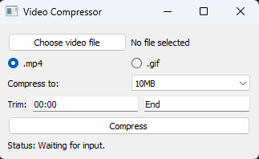
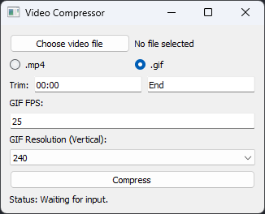

# Video Compressor App

## Overview

This is a video compression tool built using Python and the PyQt5 library. It allows users to compress videos in `.mp4` and `.gif` formats. Additionally, users can select the compression size, trim the video, and specify custom options for GIF resolution and FPS.

## Interface Previews:

### MP4 Mode:

<p align="center">
    
</p>

In this mode, you can choose to compress an MP4 video to a selected size (e.g., 8MB, 10MB, 25MB). The tool will automatically calculate the required bitrate and compress the video using Nvidia GPU encoding.

---

### GIF Mode:

<p align="center">
    
</p>

In GIF mode, you can specify the frame rate and resolution for the output GIF. Additionally, the app will allow you to resize the video to match your resolution preferences, maintaining a 16:9 aspect ratio.

## Features

- Supports `.mp4` and `.gif` output formats.
- Compression size options for `.mp4` (8MB, 10MB, 25MB, or custom).
- Ability to trim the video by specifying start and end times.
- GIF-specific settings, such as frames per second (FPS) and resolution.
- Uses Nvidia GPU (if available) for fast `.mp4` compression via the `h264_nvenc` codec.
- The application opens the compressed file in Windows Explorer upon completion.

## Requirements

- Python 3.x
- PyQt5: For building the graphical interface
- MoviePy: For handling video processing
- FFmpeg: Must be installed and available in the system path

## Installation

1. Clone the repository or download the script.
2. Install the necessary dependencies by running:

   ```bash
   pip install moviepy PyQt5
   ```

3. Make sure FFmpeg is installed and accessible through your system’s PATH.

## Usage

To run the application, you can use one of the provided scripts:

### Windows:

Run the `compressor.bat` file:

```bash
compressor.bat
```

### Linux/Mac:

Run the `compressor.sh` file:

```bash
./compressor.sh
```

### Manual execution:

Alternatively, you can manually run the Python script:

```bash
python video_compressor.py
```

Once the application is open, follow these steps:

1. **Select a video file**: Click on "Choose video file" and load the desired video.
2. **Choose output format**: Select either `.mp4` or `.gif`.
3. **Adjust settings**:
   - For `.mp4`: Choose a target file size.
   - For `.gif`: Specify the FPS and resolution.
4. **Trim video** (optional): Enter the start and end times to trim the video.
5. **Compress**: Click "Compress" to start the process. The app will notify you when compression is complete and open the folder containing the compressed file.

## Custom Default Directory

You can specify a custom default directory for the file dialog by creating a `.env` file in the project directory.

### Example `.env` file:

```bash
DEFAULT_DIRECTORY=C:/Users/YourUsername/Videos
```

If the `.env` file is not provided or the `DEFAULT_DIRECTORY` variable is missing, the application will default to empty string and use the current working directory.

## Troubleshooting

- Ensure FFmpeg is installed and properly set up in the system path.
- Check that Nvidia GPU drivers and CUDA are installed if using the `h264_nvenc` codec.
